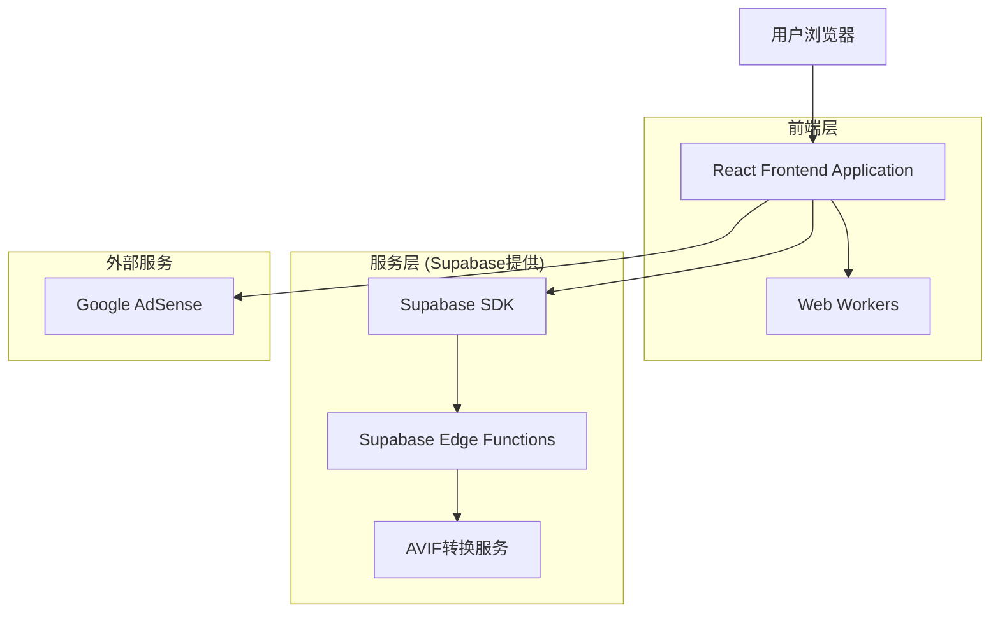
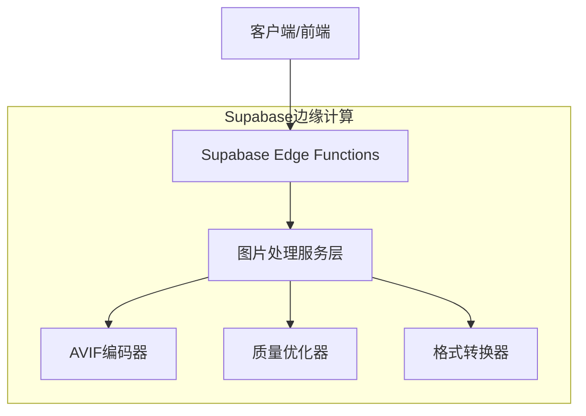
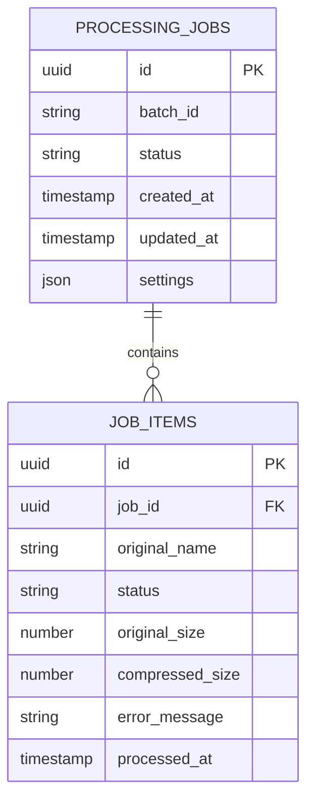

# ImageFlow 技术架构文档

## 1. 架构设计



## 2. 技术描述

- **前端**: React@18 + TypeScript + Tailwind CSS@3 + Vite
- **后端**: Supabase (Edge Functions for AVIF processing)
- **图片处理**: Canvas API + Web Workers + WASM库
- **状态管理**: React Context + useReducer
- **文件处理**: File API + JSZip
- **广告服务**: Google AdSense

## 3. 路由定义

| 路由 | 用途 |
|------|------|
| / | 主页面，包含所有核心功能模块 |
| /about | 关于页面，产品介绍和使用说明 |
| /privacy | 隐私政策页面，数据处理说明 |

## 4. API定义

### 4.1 核心API

**AVIF转换服务**
```
POST /api/convert-avif
```

请求:
| 参数名称 | 参数类型 | 是否必需 | 描述 |
|----------|----------|----------|------|
| imageData | string | true | Base64编码的图片数据 |
| quality | number | true | 压缩质量 (0-100) |
| format | string | true | 输出格式 (avif) |

响应:
| 参数名称 | 参数类型 | 描述 |
|----------|----------|------|
| success | boolean | 转换是否成功 |
| data | string | Base64编码的转换结果 |
| error | string | 错误信息 (如果失败) |

示例:
```json
{
  "imageData": "data:image/jpeg;base64,/9j/4AAQSkZJRgABAQAAAQ...",
  "quality": 75,
  "format": "avif"
}
```

**批量处理状态查询**
```
GET /api/batch-status/{batchId}
```

响应:
| 参数名称 | 参数类型 | 描述 |
|----------|----------|------|
| batchId | string | 批次ID |
| status | string | 处理状态 (processing/completed/failed) |
| progress | number | 处理进度 (0-100) |
| results | array | 处理结果数组 |

## 5. 服务器架构图



## 6. 数据模型

### 6.1 数据模型定义



### 6.2 数据定义语言

**处理任务表 (processing_jobs)**
```sql
-- 创建表
CREATE TABLE processing_jobs (
    id UUID PRIMARY KEY DEFAULT gen_random_uuid(),
    batch_id VARCHAR(255) UNIQUE NOT NULL,
    status VARCHAR(50) DEFAULT 'pending' CHECK (status IN ('pending', 'processing', 'completed', 'failed')),
    settings JSONB NOT NULL,
    created_at TIMESTAMP WITH TIME ZONE DEFAULT NOW(),
    updated_at TIMESTAMP WITH TIME ZONE DEFAULT NOW()
);

-- 创建索引
CREATE INDEX idx_processing_jobs_batch_id ON processing_jobs(batch_id);
CREATE INDEX idx_processing_jobs_status ON processing_jobs(status);
CREATE INDEX idx_processing_jobs_created_at ON processing_jobs(created_at DESC);

-- 权限设置
GRANT SELECT ON processing_jobs TO anon;
GRANT ALL PRIVILEGES ON processing_jobs TO authenticated;
```

**任务项目表 (job_items)**
```sql
-- 创建表
CREATE TABLE job_items (
    id UUID PRIMARY KEY DEFAULT gen_random_uuid(),
    job_id UUID REFERENCES processing_jobs(id) ON DELETE CASCADE,
    original_name VARCHAR(255) NOT NULL,
    status VARCHAR(50) DEFAULT 'pending' CHECK (status IN ('pending', 'processing', 'completed', 'failed')),
    original_size BIGINT NOT NULL,
    compressed_size BIGINT,
    compression_ratio DECIMAL(5,2),
    error_message TEXT,
    processed_at TIMESTAMP WITH TIME ZONE,
    created_at TIMESTAMP WITH TIME ZONE DEFAULT NOW()
);

-- 创建索引
CREATE INDEX idx_job_items_job_id ON job_items(job_id);
CREATE INDEX idx_job_items_status ON job_items(status);
CREATE INDEX idx_job_items_processed_at ON job_items(processed_at DESC);

-- 权限设置
GRANT SELECT ON job_items TO anon;
GRANT ALL PRIVILEGES ON job_items TO authenticated;

-- 初始化数据
INSERT INTO processing_jobs (batch_id, status, settings)
VALUES 
    ('demo-batch-001', 'completed', '{"quality": 75, "format": "webp"}'),
    ('demo-batch-002', 'processing', '{"quality": 85, "format": "avif"}');
```

**存储桶配置**
```sql
-- 创建存储桶 (通过Supabase Dashboard或CLI)
-- 临时文件存储桶，用于AVIF转换过程中的中间文件
CREATE POLICY "Allow anonymous uploads" ON storage.objects
FOR INSERT TO anon
WITH CHECK (bucket_id = 'temp-processing');

CREATE POLICY "Allow anonymous downloads" ON storage.objects
FOR SELECT TO anon
USING (bucket_id = 'temp-processing');

-- 自动清理策略 (24小时后删除临时文件)
CREATE OR REPLACE FUNCTION cleanup_temp_files()
RETURNS void AS $$
BEGIN
    DELETE FROM storage.objects 
    WHERE bucket_id = 'temp-processing' 
    AND created_at < NOW() - INTERVAL '24 hours';
END;
$$ LANGUAGE plpgsql;

-- 创建定时任务
SELECT cron.schedule('cleanup-temp-files', '0 2 * * *', 'SELECT cleanup_temp_files();');
```